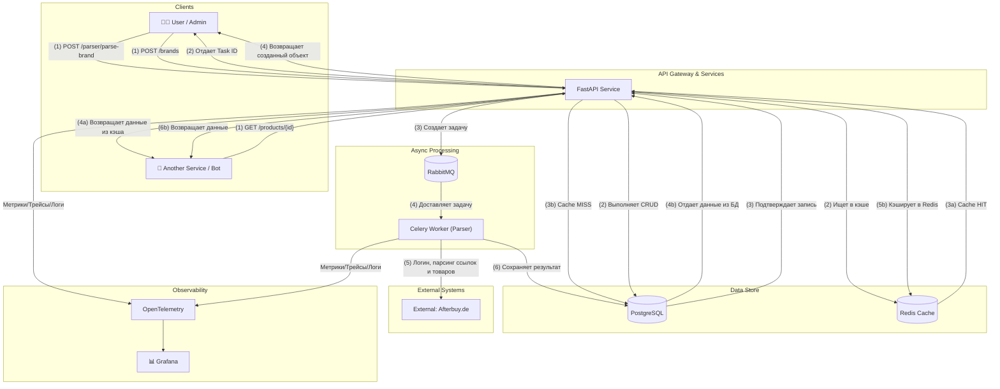

# **High-Performance Afterbuy API & Parsing Engine**

[](https://www.python.org/)
[](https://fastapi.tiangolo.com/)
[](https://www.postgresql.org/)
[](https://docs.celeryq.dev/en/stable/)
[](https://github.com/psf/black)

Асинхронный API-сервис, созданный для замены медленного и нестабильного парсинга на Selenium. Проект был разработан для компании **XXL MEBEL** с целью кардинально ускорить и автоматизировать процессы работы с товарами на E-commerce платформе Afterbuy.

**Ключевое достижение: сокращение времени обработки одной товарной коллекции с ~60 минут до 1-5 минут, с полной автоматизацией через фоновые задачи.**

---

## 🎯 Проблема (The Problem)

До создания этого API, получение данных из Afterbuy происходило через браузерную автоматизацию (Playwright/Selenium). Этот подход имел критические недостатки:
*   **🐢 Низкая скорость:** Полный парсинг одной коллекции занимал до часа, что блокировало оперативное обновление ассортимента.
*   **📉 Нестабильность:** Зависания браузера, изменения в верстке сайта и CAPTCHA приводили к частым сбоям и требовали постоянного ручного перезапуска.
*   **💻 Высокая нагрузка на ресурсы:** Запуск headless-браузеров требовал значительных мощностей CPU и RAM.
*   **🧩 Отсутствие централизации:** Данные были разрознены, не было единого API для доступа к информации о товарах, тканях и их связях.

## 🚀 Решение (The Solution)

Была с нуля спроектирована и разработана комплексная система, состоящая из высокопроизводительного внутреннего API и движка для асинхронного парсинга.

*   **🕵️‍♂️ Reverse-Engineering:** Вместо хрупкого парсинга HTML-страниц, я провел **reverse-engineering** внутреннего API платформы Afterbuy, что позволило взаимодействовать с данными напрямую, быстро и надежно.
*   **⚡ Асинхронный API-сервис:** Написан на **FastAPI** с использованием **AIOHTTP** для внешних запросов. Это обеспечивает высочайшую производительность и способность обрабатывать сотни одновременных запросов.
*   **📦 Фоновая обработка задач:** Все долгие операции (парсинг тысяч товаров) вынесены в фоновые задачи с помощью **Celery** и **RabbitMQ**. API моментально отвечает, отдавая `task_id`, а вся работа происходит в фоне.
*   **🛡️ Надежность и отказоустойчивость:** Реализован полный цикл обработки данных: от аутентификации в Afterbuy и получения ссылок до парсинга каждого товара и сохранения в базу данных. Внедрены механизмы rate-limiting (`slowapi`), детальное логирование и кастомная обработка десятков исключений.
*   **📊 Полная наблюдаемость (Observability):** Система интегрирована со стеком мониторинга **Prometheus, Grafana, Loki, Tempo** через `OpenTelemetry`. Это позволяет в реальном времени отслеживать состояние сервиса, производительность эндпоинтов, трейсы запросов и системные логи.
*   **🔗 Продвинутый маппинг данных:** Разработан сервис для автоматического сопоставления товаров между разными брендами (JV и XL) с использованием алгоритмов нечеткого сравнения строк (`thefuzz`) для поиска похожих товаров по артикулу, свойствам и изображениям.

---

## 🏛️ Архитектура

Проект построен на основе **многоуровневой архитектуры (Layered Architecture)**, обеспечивающей четкое разделение ответственности:
1.  **Слой API (Routers):** Отвечает за прием HTTP-запросов, валидацию входных данных (`Pydantic`) и вызов соответствующего сервиса.
2.  **Слой бизнес-логики (Services):** Содержит основную логику приложения. Оркестрирует вызовы репозиториев и других сервисов.
3.  **Слой доступа к данным (Repositories):** Абстрагирует работу с базой данных (`SQLAlchemy`), предоставляя сервисам чистый интерфейс для CRUD-операций.

#### Диаграмма взаимодействия компонентов:



---

## 🛠️ Технологический стек

| Категория | Технология |
| :--- | :--- |
| **Backend** | `FastAPI`, `Pydantic`, `AIOHTTP` |
| **База данных** | `PostgreSQL`, `SQLAlchemy` (ORM), `Alembic` (Миграции) |
| **Кэш и Очереди** | `Redis`, `Celery`, `RabbitMQ` |
| **DevOps** | `Docker`, `Docker Compose` |
| **Мониторинг** | `Prometheus`, `Grafana`, `Loki`, `Tempo`, `OpenTelemetry` |
| **Аутентификация** | `JWT (PyJWT)`, `Argon2` (хэширование паролей) |
| **Парсинг** | `lxml` (для HTML), `thefuzz` (для маппинга) |
| **Тестирование**| `Pytest` (планируется) |
| **Прочее**| `slowapi` (Rate Limiting), `Pandas` (для экспорта в Excel) |

---

## 🌟 Ключевые фичи

*   **Полностью асинхронный пайплайн:** От HTTP-запроса до записи в БД.
*   **JWT Аутентификация:** С разделением ролей (пользователь, администратор) и refresh-токенами.
*   **Гибкая система парсинга:** Возможность запускать парсинг для всей системы, отдельного бренда или даже одной товарной коллекции через API.
*   **Маппинг данных:** Автоматическое сопоставление товаров и коллекций между разными сущностями.
*   **Динамический экспорт:** Возможность выгружать любые отфильтрованные данные в `.xlsx` формат на лету.
*   **Чистая архитектура:** Строгое разделение на слои (routers, services, repositories) упрощает поддержку и масштабирование.
*   **Lazy-инициализация БД:** `DatabaseHelper` корректно работает с `Celery`, создавая `engine` только при необходимости.
*   **Продуманная конфигурация:** Все настройки вынесены в переменные окружения с использованием `Pydantic-Settings`.

---

## ⚙️ Установка и запуск

Проект полностью контейнеризирован. Для локального запуска требуется `Docker` и `Docker Compose`.

1.  **Клонировать репозиторий:**
    ```bash
    git clone https://github.com/fluffy-dev/afterbuy-api.git
    cd afterbuy-api
    ```

2.  **Создать и настроить `.env` файл:**
    Скопируйте `.env.example` в `.env` и заполните своими данными.
    ```bash
    cp .env.example .env
    ```
    ```dotenv
    # .env.example

    # === PostgreSQL ===
    DB_HOST=db
    DB_PORT=5432
    DB_NAME=afterbuy
    DB_USER=rauan
    DB_PASSWORD=your_strong_password

    # === Redis ===
    REDIS_HOST=redis
    REDIS_PORT=6379

    # === JWT & Security ===
    SECRET_KEY=your_super_secret_key_for_jwt
    SECRET_KEY_ALGORITHM=HS256

    # === Afterbuy Credentials (JV) ===
    APP_JV_BASE_URL=jv-url.afterbuy.de
    JV_USERNAME=your_jv_username
    JV_PASSWORD=your_jv_password

    # === Afterbuy Credentials (XL) ===
    APP_XL_BASE_URL=xl-url.afterbuy.de
    XL_USERNAME=your_xl_username
    XL_PASSWORD=your_xl_password

    # === Parser Settings ===
    PARSING_PER_PAGE=500
    PARSER_BATCH_SIZE=3
    ```

3.  **Запустить все сервисы:**
    ```bash
    docker-compose up -d --build
    ```
    Эта команда соберет образы и запустит все контейнеры (FastAPI, Celery, Postgres, Redis) в фоновом режиме.

---

## 📖 Пример использования API

<details>
<summary><strong>POST /v1/auth/login</strong> - Аутентификация пользователя</summary>

**Описание:** Получение JWT токенов доступа и обновления.

**Пример запроса `curl`:**
```bash
curl -X POST "http://localhost:8000/v1/auth/login" \
-H "Content-Type: application/json" \
-d '{
  "login": "admin_login",
  "password": "admin_password"
}'
```

**Пример ответа `200 OK`:**
```json
{
  "access_token": "eyJhbGciOiJIUzI1NiIsInR5cCI6IkpXVCJ9...",
  "refresh_token": "eyJhbGciOiJIUzI1NiIsInR5cCI6IkpXVCJ9..."
}
```
</details>

<details>
<summary><strong>POST /v1/parser/parse-brand</strong> - Запуск парсинга для бренда</summary>

**Описание:** Асинхронно запускает задачу парсинга всех товаров для указанного бренда. Требует токен администратора.

**Пример запроса `curl`:**
```bash
curl -X POST "http://localhost:8000/v1/parser/parse-brand" \
-H "Authorization: Bearer <your_access_token>" \
-H "Content-Type: application/json" \
-d '{
  "name": "JV"
}'
```

**Пример ответа `202 Accepted`:**
```json
{
  "message": "Parsing process initiated for brand: name='JV'",
  "task_id": "a1b2c3d4-e5f6-a7b8-c9d0-e1f2a3b4c5d6"
}
```
</details>

<details>
<summary><strong>GET /v1/parser/status/{task_id}</strong> - Проверка статуса задачи</summary>

**Описание:** Получение текущего состояния фоновой задачи Celery.

**Пример запроса `curl`:**
```bash
curl -X GET "http://localhost:8000/v1/parser/status/a1b2c3d4-e5f6-a7b8-c9d0-e1f2a3b4c5d6" \
-H "Authorization: Bearer <your_access_token>"
```

**Пример ответа (задача в процессе):**
```json
{
  "task_id": "a1b2c3d4-e5f6-a7b8-c9d0-e1f2a3b4c5d6",
  "status": "PROGRESS",
  "result": {
    "current": 50,
    "total": 200,
    "status": "Parsing item 51 of 200"
  }
}
```
**Пример ответа (задача завершена):**
```json
{
  "task_id": "a1b2c3d4-e5f6-a7b8-c9d0-e1f2a3b4c5d6",
  "status": "SUCCESS",
  "result": { "Maybe all good": "I think..." }
}
```
</details>

<details>
<summary><strong>POST /v1/products/filter</strong> - Фильтрация товаров</summary>

**Описание:** Получение списка товаров по заданным параметрам с пагинацией.

**Пример запроса `curl`:**
```bash
curl -X POST "http://localhost:8000/v1/products/filter?limit=5" \
-H "Authorization: Bearer <your_access_token>" \
-H "Content-Type: application/json" \
-d '{
  "brand_id": 1
}'
```

**Пример ответа `200 OK`:**
```json
[
  {
    "id": 101,
    "brand_id": 1,
    "fabric_id": 12,
    "url_id": 150,
    "collection": "Sofa Collection 2024",
    "product_num": "JV-SOFA-001",
    "price": 1299.99,
    "properties": "{\"color\": \"grey\", \"material\": \"velvet\"}",
    "article": "A-12345",
    "pic_main": "https://cdn.example.com/main.jpg",
    "pics": "https://cdn.example.com/1.jpg https://cdn.example.com/2.jpg",
    "category": "Living Room",
    "link": "https://jv.afterbuy.de/...",
    "ean": "1234567890123"
  }
]
```
</details>

---

## 📝 Структура проекта

Проект имеет модульную структуру для лучшей организации и масштабируемости:

```
src/
├── app.py              # Инициализация FastAPI приложения
├── handlers.py         # Глобальные обработчики исключений
├── middleware.py       # Middleware (CORS, Rate Limiting)
├── routes.py           # Главный роутер, агрегирующий все остальные
├── telemetry.py        # Настройка OpenTelemetry и Prometheus
│
├── auth/               # Логика аутентификации и авторизации (JWT)
├── brand/              # CRUD для брендов (JV, XL)
├── config/             # Конфигурация проекта (БД, Redis, JWT, CORS)
├── export/             # Логика экспорта данных (в Excel)
├── fabric/             # CRUD для коллекций/тканей
├── fabric_mapping/     # Логика сопоставления коллекций между брендами
├── libs/               # Общие библиотеки (HTTP клиент, Celery, Redis)
├── mapping/            # Сервис для запуска полного цикла маппинга
├── parser/             # ★ Основная логика парсинга
│   ├── html_utils/     # Низкоуровневые парсеры lxml
│   ├── http_utils/     # Клиенты для взаимодействия с Afterbuy
│   ├── parser/         # Высокоуровневые сервисы-парсеры
│   └── tasks.py        # Задачи Celery для фоновой обработки
│
├── product/            # CRUD для товаров
├── product_mapping/    # Логика сопоставления товаров
├── url/                # CRUD для URL-адресов товаров
└── user/               # CRUD для пользователей
```

---
**Рауан Асетов** / [GitHub](https://github.com/fluffy-dev) / [Email](mailto:asetovrauan0@gmail.com)
